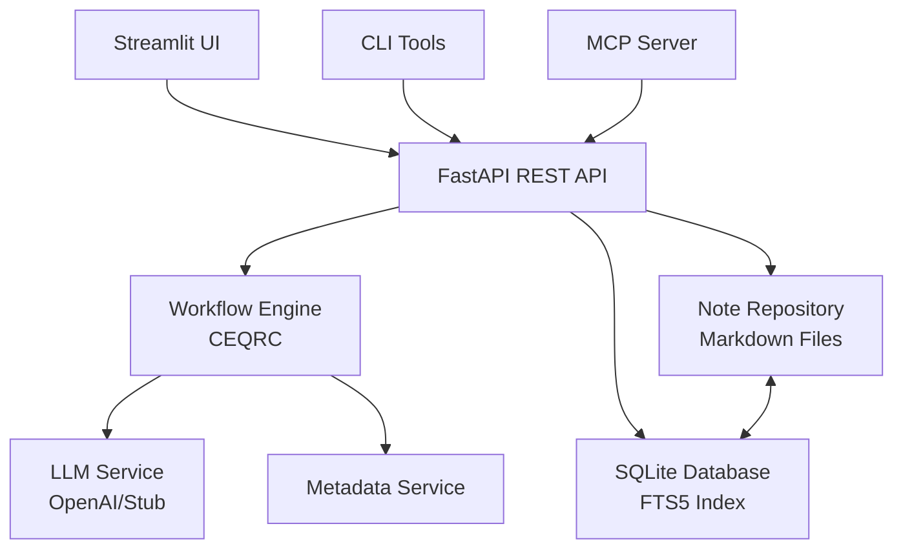

Source: https://raw.githubusercontent.com/joshylchen/zettelkasten/main/README.md
Fetched: 2026-08-01T10:38:34


# 🧠 Zettelkasten AI Assistant

A comprehensive, AI-powered Zettelkasten (slip-box) knowledge management system that helps you capture, refine, and connect atomic ideas. Built with modern Python and designed for both personal use and integration with AI systems via the Model Context Protocol (MCP).

*Created by JoshChen*

## 🎯 **Problem & Solution Scope**

### **The Knowledge Management Challenge**

Managing knowledge effectively is hard when our brains are constrained by limited working memory and high cognitive load. Traditional note-taking or Zettelkasten tools often become just dumping grounds for information, adding **extraneous cognitive load** (effort spent managing the tool itself) on top of the **intrinsic load** (the difficulty of the content). This leaves little room for **germane load** – the actual learning and schema-building that leads to understanding. The result is lots of notes but little insight, as the user is overwhelmed by organizing mechanics instead of focusing on knowledge processing.

### **Our Solution: An Active Conversational Partner**

**Zettelkasten LLM Assistant** is designed as an **active conversational partner** rather than a passive note archive. It guides the user through capturing ideas, refining them (using the Feynman Technique), and integrating them into a knowledge network. By doing so, it:

- **Reduces extraneous load**: The system automates organizing, linking, and summarizing
- **Maximizes germane load**: Users spend effort on understanding and explaining concepts
- **Acts as a Socratic partner**: The LLM plays a curious 12-year-old student, prompting clarity through questions
- **Transforms tacit to explicit knowledge**: Converts intuitive understanding into clear, shareable notes
- **Builds your "second brain"**: Creates an external cognitive system that enhances your thinking

This approach shifts the cognitive burden from tool management to knowledge processing, enabling deeper learning and insight generation.

## 🎯 **Core Philosophy**

This system implements the Zettelkasten method digitally with AI assistance:
- **Atomic Notes**: One idea per note, uniquely identified and timestamped
- **Bi-directional Linking**: Typed relationships between notes create a knowledge graph  
- **AI-Enhanced Workflow**: Optional LLM assistance for refinement, summarization, and connections
- **Future-Proof Storage**: Plain Markdown files with YAML frontmatter as the source of truth
- **MCP Integration**: Expose your knowledge base to AI assistants and agents

## ✨ **Key Features**

### 📝 **Note Management**
- **Atomic Notes**: Each note contains a single concept with unique ID, title, body, and summary
- **Smart Summaries**: AI-generated summaries (280 char limit) for quick scanning
- **YAML Frontmatter**: Rich metadata including tags, links, status, and timestamps
- **Multiple Interfaces**: CLI, Web API, Streamlit UI, and MCP tools

### 🔍 **Advanced Search**
- **Full-Text Search**: SQLite FTS5 searches across titles, bodies, and summaries
- **Semantic Queries**: Support for proximity search (`NEAR/N`), phrase matching
- **Tag Filtering**: Combine text search with tag-based filtering
- **Snippet Highlights**: Search results show highlighted matching text

### 🤖 **AI-Powered Workflows**
- **CEQRC Pipeline**: Capture → Explain → Question → Refine → Connect
- **Auto-Summarization**: Generate concise summaries with configurable length limits
- **Metadata Suggestions**: AI suggests better titles, tags, and relationships
- **Link Discovery**: Automatic suggestion of connections between related notes

### 🌐 **Multiple Interfaces**
- **FastAPI REST API**: Full CRUD operations with OpenAPI documentation
- **CLI Tools**: Command-line interface for power users and automation
- **Streamlit Web UI**: User-friendly interface with real-time features
- **MCP Server**: Expose tools to AI assistants and agents

## 🚀 **Quick Start**

### Prerequisites
- Python 3.11+
- pip or conda

### Installation

```bash
# 1) Clone the repository
git clone https://github.com/joshylchen/zettelkasten
cd zettelkasten

# 2) Create and activate virtual environment
python -m venv .venv
# Windows:
.venv\Scripts\activate
# macOS/Linux:
source .venv/bin/activate

# 3) Install dependencies
pip install -r requirements.txt

# 4) Configure environment
cp .env.example .env
# Edit .env with your preferences (API keys, paths, etc.)

# 5) Initialize data directories
mkdir -p data/notes data/db
```

### Choose Your Interface

#### 🌐 **Web API** (Recommended for integrations)
```bash
python -m zettelkasten.server.api
# Access at: http://127.0.0.1:8088/docs
```

#### 🖥️ **Streamlit UI** (Best for interactive use)
```bash
streamlit run ui_streamlit.py
# Access at: http://localhost:8501
```

#### ⌨️ **Command Line**
```bash
# Create your first note
python -m zettelkasten.cli new "Machine Learning" \
  -c "The field of study focused on algorithms that improve through experience" \
  -t ai,learning,algorithms

# Search your notes
python -m zettelkasten.cli search "machine learning"

# See all commands
python -m zettelkasten.cli --help
```

### Your First Note

Using the Streamlit UI:
1. Open http://localhost:8501
2. Go to "Create / Edit" tab  
3. Enter title: "My First Zettel"
4. Add content and let AI generate a summary
5. Add relevant tags
6. Click "Create"

## 🏗️ **Architecture Overview**

### **Storage Layer**
```
data/
├── notes/           # Markdown files (source of truth)
│   ├── 20250915064516.md
│   └── 20250915064517.md
└── db/
    └── zettelkasten.db  # SQLite index + FTS
```

**Note Structure:**
```yaml
---
id: '20250915064516'
title: 'Machine Learning Fundamentals'  
summary: 'Core concepts of ML including supervised, unsupervised learning and model evaluation techniques'
tags: [ai, learning, algorithms]
links: 
  - {to: '20250915064517', type: 'supports'}
created_at: '2025-09-15T06:45:16Z'
updated_at: '2025-09-15T06:45:50Z'
status: 'PERMANENT'
---

# Machine Learning Fundamentals

Machine learning is a subset of artificial intelligence...
```

### **System Components**



### **Database Schema**
- **zettel**: Core note data (id, title, body, summary, timestamps)
- **tag**: Tag definitions  
- **zettel_tag**: Note-tag relationships
- **link**: Typed relationships between notes
- **zettel_fts**: Full-text search index (FTS5)

### **CEQRC Workflow**
1. **Capture**: Create seed notes with initial thoughts
2. **Explain**: Add detailed explanations and context
3. **Question**: AI generates probing questions (Feynman technique)
4. **Refine**: Improve content based on questions
5. **Connect**: Discover and create links to related notes

## 🔧 **Configuration**

Key environment variables in `.env`:

```bash
# Paths
ZK_NOTES_DIR=./data/notes
ZK_DB_PATH=./data/db/zettelkasten.db

# Server
ZK_HOST=127.0.0.1
ZK_PORT=8088

# AI Integration
OPENAI_API_KEY=your_key_here
ZK_LLM_PROVIDER=openai  # or 'stub' for testing

# Summary Settings  
ZK_SUMMARY_MAX_LENGTH=280

# UI
ZK_STREAMLIT_PORT=8501
```

## 📚 **API Reference**

### **Core Endpoints**

#### Notes
- `POST /notes` - Create note (auto-generates summary if not provided)
- `GET /notes/{id}` - Retrieve note with all metadata
- `PUT /notes/{id}` - Update note (regenerates summary if body changed) 
- `DELETE /notes/{id}` - Delete note and relationships

#### Search & Discovery
- `GET /search?q={query}&tag={tag}` - Full-text search across title, body, summary
- `GET /notes/{id}/backlinks` - Find notes linking to this one
- `POST /generate-summary` - Generate AI summary for text

#### Workflows
- `POST /notes/{id}/ceqrc` - Run complete CEQRC workflow
- `POST /notes/{id}/links` - Create typed relationship

#### Links
- `POST /notes/{source}/links` - Create relationship
  ```json
  {"target_id": "20250915064517", "type": "supports", "description": "optional"}
  ```

### **Link Types**
- `supports` / `supported_by` - Evidence or justification
- `refines` / `refined_by` - More specific version
- `extends` / `extended_by` - Builds upon concept
- `contradicts` / `contradicted_by` - Opposing viewpoint
- `is_example_of` / `has_example` - Concrete instance
- `related` - General association

## 🧪 **Testing**

```bash
# Run all tests
pytest

# Run with coverage
pytest --cov=zettelkasten_assistant

# Run specific test file
pytest tests/test_notes.py

# Verbose output
pytest -v
```

Test coverage includes:
- Note CRUD operations with summaries
- Full-text search across all fields
- API endpoint functionality
- CEQRC workflow execution
- Link relationship management

## 🤖 **AI Integration**

### **LLM Providers**
- **OpenAI**: Full AI features (requires API key)
- **Stub**: Testing mode with deterministic responses

### **AI-Powered Features**
- **Smart Summaries**: Generate concise summaries within character limits
- **Metadata Suggestions**: Improve titles, tags, and categorization  
- **Content Refinement**: Polish and improve note content
- **Link Discovery**: Find relationships between notes
- **Feynman Probing**: Generate questions to test understanding

### **MCP (Model Context Protocol) Integration**
Expose your Zettelkasten to AI assistants like Claude Desktop:

#### Quick MCP Setup
```bash
python setup_mcp.py  # Automated setup and config generation
```

#### Available MCP Tools
- **`zk_create_note`**: Create atomic notes with AI summaries
- **`zk_search_notes`**: Full-text search with FTS5 syntax
- **`zk_get_note`**: Retrieve notes with metadata and backlinks
- **`zk_run_ceqrc_workflow`**: Execute AI-powered learning workflow
- **`zk_suggest_links`**: Discover connections between notes
- **`zk_create_link`**: Create typed relationships (supports, refines, extends, etc.)
- **`zk_generate_summary`**: Generate AI summaries for any text

#### Claude Desktop Configuration
```json
{
  "mcpServers": {
    "zettelkasten": {
      "command": "python", 
      "args": ["path/to/mcp_server.py"],
      "env": {"OPENAI_API_KEY": "your_key_here"}
    }
  }
}
```

See `docs/MCP_SETUP.md` for complete integration guide.

## 🎯 **Use Cases**

### **Research & Learning**
- Capture research findings as atomic notes
- Build concept maps through typed links
- Use AI to generate study questions
- Create summary views of complex topics

### **Content Creation**
- Organize ideas for articles, books, courses
- Track sources and evidence
- Build argument structures through links
- Generate outlines from connected notes

### **Knowledge Management**
- Personal wiki with AI assistance
- Meeting notes with automatic summaries
- Documentation with smart cross-references
- Project knowledge base

### **AI Assistant Integration**
- Let ChatGPT/Claude access your knowledge base
- Automated note creation from conversations
- AI-powered content suggestions
- Intelligent information retrieval

## 📖 **Documentation**

| Document | Description |
|----------|-------------|
| `docs/USER_GUIDE.md` | Complete user manual with examples |
| `docs/USE_CASES.md` | Real-world usage scenarios |
| `docs/DESIGN.md` | Architecture and design decisions |
| `docs/MCP_INTEGRATION.md` | AI assistant integration guide |
| `docs/SPECS.md` | Technical specifications and API reference |

## 🤝 **Contributing**

1. Fork the repository
2. Create a feature branch (`git checkout -b feature/amazing-feature`)
3. Make your changes
4. Add tests for new functionality  
5. Run the test suite (`pytest`)
6. Commit your changes (`git commit -m 'Add amazing feature'`)
7. Push to the branch (`git push origin feature/amazing-feature`)
8. Open a Pull Request

## 🔗 **Related Projects**

- [Model Context Protocol](https://github.com/modelcontextprotocol/servers) - AI assistant integration
- [Obsidian](https://obsidian.md/) - Popular note-taking with linking
- [Logseq](https://logseq.com/) - Block-based knowledge management
- [Roam Research](https://roamresearch.com/) - Networked thought

## ⚖️ **License**

MIT License - see `LICENSE` file for details.

Built with ❤️ for knowledge workers, researchers, and AI enthusiasts.

